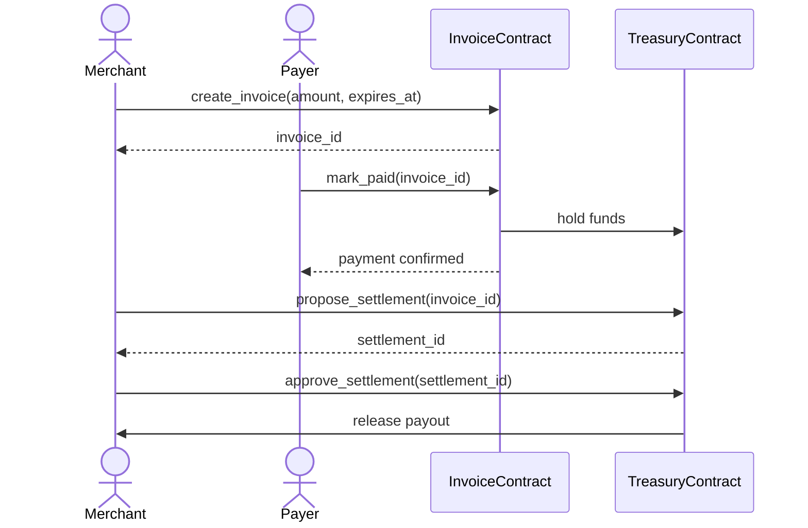

# COMEBACKHERE

> **COMEBACKHERE Protocol** — The Stripe for Stellar.
> Founded and built by **[dreamgene](https://github.com/dreamgeneX)** · Founder & CEO

Tooling, deployment scripts, ABIs, and integration resources for COMEBACKHERE Protocol.

## Architecture

The following sequence diagram illustrates the primary payment flow.



## Workspace

- `abis/`: committed ABI metadata consumed by `comebackhere-backend`
- `scripts/`: deployment, verification, and ABI generation tooling
- `docs/`: developer guides and deployment documentation
- `tests/`: workspace-level integration tests

## Local Development

### Starting the Local Environment

Requires Docker and Docker Compose.

```sh
docker-compose up -d
```

This starts:
- **Soroban Node**: Stellar quickstart (Horizon at `http://localhost:8000`)
- **Redis**: Event consumer backing service (port 6379)

Check service health:
```sh
docker-compose ps
curl http://localhost:8000/health
```

### Deploying Contracts Locally

```sh
cp .env.local.example .env.local
# Edit .env.local with your test keys
scripts/deploy_local.sh
```

### Tearing Down

```sh
docker-compose down
# To also remove persistent data:
docker-compose down -v
```

## ABI Snapshots

Committed ABI metadata in `abis/` is generated from contract sources. The contract sources live in `COMEBACKHERE-contracts/`. Before opening a PR that changes contract behavior, refresh snapshots:

```sh
make update-abi-snapshots
# or
just snapshot
```

Confirm the tree is clean:

```sh
make check-abi-snapshots
# or
just check-snapshot
git diff --exit-code abis/
```

## Deployment

```sh
cp .env.testnet.example .env.testnet
scripts/deploy_testnet.sh
```

After deployment, contract IDs are exported to `artifacts/addresses.json` (gitignored; environment-specific). See `artifacts/addresses.json.example` for the schema.

Mainnet deployment is intentionally manual and must go through multi-sig governance.

See `docs/MAINNET_DEPLOYMENT.md` for the live deployment checklist and signing ceremony.

## License

MIT
