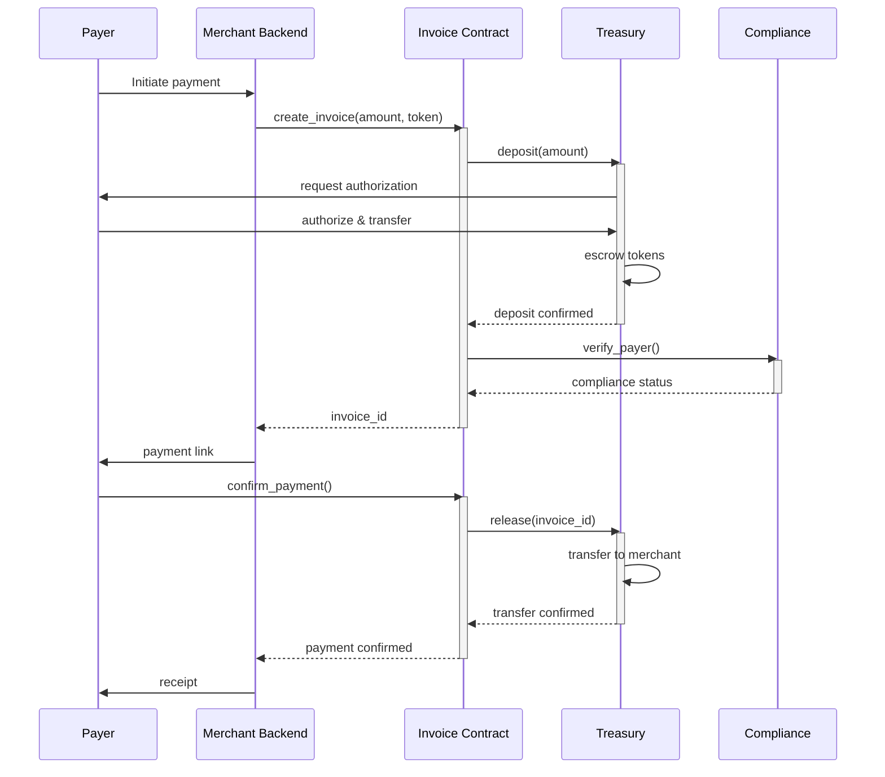

# COMEBACKHERE Protocol

> **The Stripe for Stellar**
> Secure, scalable, and developer-friendly payment infrastructure built on the Stellar network.

This repository contains the tooling, deployment scripts, contract ABIs, documentation, and integration resources required to develop, deploy, and maintain the **COMEBACKHERE Protocol**.

---

## Overview

COMEBACKHERE provides the infrastructure needed to build seamless payment experiences on Stellar. This repository serves as the central workspace for:

* Smart contract deployment
* ABI generation and management
* Developer documentation
* Local development tooling
* Integration and deployment scripts
* Workspace-level testing

---

## Quickstart for Merchants

Integrate COMEBACKHERE payments in three steps: create an invoice, set up
webhooks, and process the payment. This section links to the full reference
docs rather than duplicating them.

### 1. Create an invoice

```bash
curl -X POST http://localhost:3000/invoices \
  -H "Content-Type: application/json" \
  -d '{
    "merchant_address": "G...",
    "token": "USDC",
    "amount": 1000000,
    "due_date": 1720000000
  }'
```

The response includes `invoice_id` — share this with your payer.

> Full request/response shapes: [docs/api-reference.md](docs/api-reference.md#post-invoices)

### 2. Set up webhooks

Configure `WEBHOOK_URL` and `WEBHOOK_SIGNING_SECRET` in your environment so
the backend can notify your system when payments land.

All outbound webhook POSTs are signed with HMAC-SHA256 over the exact raw body
bytes. Verify the `X-COMEBACKHERE-Signature` header before processing:

```typescript
import { createHmac, timingSafeEqual } from "crypto"

function verifyWebhook(rawBody: string, signature: string, secret: string): boolean {
  const expected = createHmac("sha256", secret).update(rawBody, "utf8").digest("hex")
  const expectedBuf = Buffer.from(expected, "hex")
  const actualBuf = Buffer.from(signature, "hex")

  // timingSafeEqual throws on a length mismatch, so reject short or
  // malformed signatures before comparing.
  if (expectedBuf.length !== actualBuf.length) return false
  return timingSafeEqual(expectedBuf, actualBuf)
}
```

> Webhook events and configuration: [docs/api-reference.md](docs/api-reference.md#webhooks)

### 3. Minimal payment flow

```text
Merchant            Backend              Payer
  |                   |                    |
  |-- create_invoice ->|                    |
  |                   |                    |
  |  (share invoice_id with payer)         |
  |                   |                    |
  |                   |<-- pay off-chain ---|
  |                   |                    |
  |<-- webhook POST --|                    |
  |  (settlement_executed)                 |
```

For the full end-to-end testnet walkthrough (funding accounts, deploying
contracts, paying with USDC, and executing a settlement), see
[docs/TESTNET_ONBOARDING.md](docs/TESTNET_ONBOARDING.md).

> Rate limits apply to all API endpoints. See [docs/rate-limits.md](docs/rate-limits.md).

---

## Architecture

The diagram below illustrates the primary payment flow through the COMEBACKHERE Protocol.


```mermaid
sequenceDiagram
    participant Payer
    participant Merchant as Merchant Backend
    participant Invoice as Invoice Contract
    participant Treasury
    participant Compliance

    Payer->>Merchant: Initiate payment
    Merchant->>Invoice: create_invoice(amount, token)
    activate Invoice
    Invoice->>Treasury: deposit(amount)
    activate Treasury
    Treasury->>Payer: request authorization
    Payer->>Treasury: authorize & transfer
    Treasury->>Treasury: escrow tokens
    Treasury-->>Invoice: deposit confirmed
    deactivate Treasury
    Invoice->>Compliance: verify_payer()
    activate Compliance
    Compliance-->>Invoice: compliance status
    deactivate Compliance
    Invoice-->>Merchant: invoice_id
    deactivate Invoice

    Merchant->>Payer: payment link
    Payer->>Invoice: confirm_payment()
    activate Invoice
    Invoice->>Treasury: release(invoice_id)
    activate Treasury
    Treasury->>Treasury: transfer to merchant
    Treasury-->>Invoice: transfer confirmed
    deactivate Treasury
    Invoice-->>Merchant: payment confirmed
    deactivate Invoice

    Merchant->>Payer: receipt
```

---

## Repository Structure

```text
.
├── abis/          # Contract ABI files consumed by the backend
├── docs/          # Developer guides and deployment documentation
├── scripts/       # Deployment, verification, and utility scripts
└── tests/         # Workspace-level integration tests
```

| Directory  | Description                                            |
| ---------- | ------------------------------------------------------ |
| `abis/`    | Generated contract ABIs used by `comebackhere-backend` |
| `scripts/` | Deployment, verification, and ABI generation scripts   |
| `docs/`    | Technical documentation and deployment guides          |
| `tests/`   | Integration and workspace-level test suites            |

---

# Local Development

## Prerequisites

Before getting started, ensure you have:

* Docker
* Docker Compose

---

## Required Environment Variables Checklist

Before starting the stack, ensure your local `.env` (or service-specific `.env` files) defines these required values:

### Backend (`comebackhere-backend` or Docker `backend`)

| Variable | Required | Default | Description |
| --- | --- | --- | --- |
| `SOROBAN_RPC_URL` | Yes | `http://localhost:8000/soroban/rpc` | Soroban RPC endpoint |
| `INVOICE_CONTRACT_ID` | Yes* | — | Deployed invoice contract address (required when calling invoice routes) |
| `TREASURY_CONTRACT_ID` | Yes* | — | Deployed treasury contract address (required when calling treasury routes) |
| `USDC_CONTRACT_ID` | Yes* | — | USDC token contract address |
| `SIGNER_SECRET_KEY` | Yes | — | Stellar secret key used for signing transactions |
| `MONGODB_URI` | No | `mongodb://localhost:27017` | MongoDB connection URI for indexer state |
| `REDIS_URL` | No | `redis://localhost:6379` | Redis connection URL for rate limiting & event channels |
| `PORT` | No | `3000` (host) / `3001` (Docker) | HTTP server listen port |

\* Required at runtime when invoking the respective contract-backed endpoints.

### Frontend (`comebackhere-frontend` or Docker `frontend`)

| Variable | Required | Default | Description |
| --- | --- | --- | --- |
| `VITE_API_URL` | Yes | `http://localhost:3000` | Backend API base URL |
| `VITE_SOROBAN_RPC` | Yes | `http://localhost:8000/soroban/rpc` | Soroban RPC endpoint for wallet interactions |
| `VITE_HORIZON_URL` | No | `http://localhost:8000` | Horizon API URL |
| `VITE_NETWORK_PASSPHRASE` | No | `Standalone Network ; February 2025` | Stellar network passphrase |

---

## Start the Development Environment

Launch all required services:

```bash
docker-compose up -d
```

This starts the following services:

| Service | Description | Default Port | Health Check |
| --- | --- | --- | --- |
| `soroban` | Stellar Quickstart standalone node + RPC + Horizon | `8000`, `11625`, `11626` | `curl -f http://localhost:8000/health` |
| `redis` | Redis 7 cache and event queue | `6379` | `redis-cli ping` |
| `mongodb` | MongoDB 7 persistence for indexer state | `27017` | `mongosh --eval "db.adminCommand('ping')"` |
| `backend` | Protocol backend API | `3001` | `curl -f http://localhost:3001/health/rpc` |
| `frontend` | Protocol web dashboard / UI | `5173` | `curl -f http://localhost:5173/` |

---

## Verify the Services

### 1. Check Container Health with `docker-compose ps`

Check that all containers are running and in a `(healthy)` status:

```bash
docker-compose ps
```

Expected output:

```text
NAME                      IMAGE                       COMMAND                  SERVICE    CREATED          STATUS                    PORTS
comebackhere-backend-1    comebackhere-backend        "docker-entrypoint.s…"   backend    15 seconds ago   Up 14 seconds (healthy)   0.0.0.0:3001->3001/tcp
comebackhere-frontend-1   comebackhere-frontend       "/bin/sh -c 'npm run…"   frontend   15 seconds ago   Up 14 seconds (healthy)   0.0.0.0:5173->5173/tcp
comebackhere-mongodb-1    mongo:7                     "docker-entrypoint.s…"   mongodb    15 seconds ago   Up 15 seconds (healthy)   0.0.0.0:27017->27017/tcp
comebackhere-redis-1      redis:7-alpine              "docker-entrypoint.s…"   redis      15 seconds ago   Up 15 seconds (healthy)   0.0.0.0:6379->6379/tcp
comebackhere-soroban-1    stellar/quickstart:latest   "/start standalone"      soroban    15 seconds ago   Up 15 seconds (healthy)   0.0.0.0:8000->8000/tcp, 0.0.0.0:11625-11626->11625-11626/tcp
```

### 2. Service Startup Health Checks

Verify each service responds as expected:

- **Soroban node:**

  ```bash
  curl -s http://localhost:8000/health
  # Expected: {"status":"healthy"}
  ```

- **Redis:**

  ```bash
  docker-compose exec -T redis redis-cli ping
  # Expected: PONG
  ```

- **MongoDB:**

  ```bash
  docker-compose exec -T mongodb mongosh --eval "db.adminCommand('ping')" --quiet
  # Expected: { ok: 1 }
  ```

- **Backend API:**

  ```bash
  curl -s http://localhost:3001/health/rpc
  # Expected: {"status":"ok"}
  ```

- **Frontend UI:**

  ```bash
  curl -s -o /dev/null -w "%{http_code}\n" http://localhost:5173/
  # Expected: 200
  ```

### 3. Copy-Paste Verification Section

Run this single snippet before executing app-specific commands to confirm the entire stack is operational:

```bash
echo "Verifying local stack readiness..."
curl -sf http://localhost:8000/health > /dev/null && echo "✔ Soroban node healthy (port 8000)"
docker-compose exec -T redis redis-cli ping 2>/dev/null | grep -q "PONG" && echo "✔ Redis healthy (port 6379)"
docker-compose exec -T mongodb mongosh --eval "db.adminCommand('ping')" --quiet 2>/dev/null | grep -q "1" && echo "✔ MongoDB healthy (port 27017)"
curl -sf http://localhost:3001/health/rpc > /dev/null && echo "✔ Backend API healthy (port 3001)"
curl -sf -o /dev/null http://localhost:5173/ && echo "✔ Frontend UI healthy (port 5173)"
echo "Stack is ready for development."
```

---

## Using `docker-compose.override.yml`

This repository includes a `docker-compose.override.yml` file.

Docker Compose automatically merges this file with `docker-compose.yml` whenever you run:

```bash
docker-compose up
```

The override configuration adds the following development services:

* Backend
* Frontend

This allows you to run the complete application stack locally without modifying the base compose configuration.

### Common Customizations

Developers often update the override file to:

* Change `VITE_API_URL`
* Change `VITE_SOROBAN_RPC`
* Modify port mappings
* Mount local source directories for hot reloading
* Customize environment-specific settings

To view the final merged configuration:

```bash
docker-compose config
```

---

# ABI Snapshot Verification

Before committing changes, ensure the generated ABI snapshots are up to date.

Using Make:

```bash
make check-abi-snapshots
```

Or with Just:

```bash
just check-snapshot
```

Finally, verify there are no uncommitted ABI changes:

```bash
git diff --exit-code abis/
```

---

# Deployment

## Testnet Deployment

Copy the example environment file:

```bash
cp .env.testnet.example .env.testnet
```

Deploy the contracts:

```bash
scripts/deploy_testnet.sh
```

After deployment, contract addresses are exported to:

```text
artifacts/addresses.json
```

This file is intentionally ignored by Git because it contains environment-specific deployment data.

For the expected structure, refer to:

```text
artifacts/addresses.json.example
```

---

## Mainnet Deployment

Mainnet deployments are intentionally **manual** and require approval through the project's multisignature governance process.

Before deploying to production, follow the complete deployment checklist and signing ceremony documented in:

```text
docs/MAINNET_DEPLOYMENT.md
```

---

# Contributing

Before opening a pull request:

* Keep ABI snapshots up to date.
* Verify all tests pass.
* Review deployment documentation if modifying contracts or deployment scripts.
* Ensure your branch is clean and free of unintended changes.

---

# License

This project is licensed under the **MIT License**.
